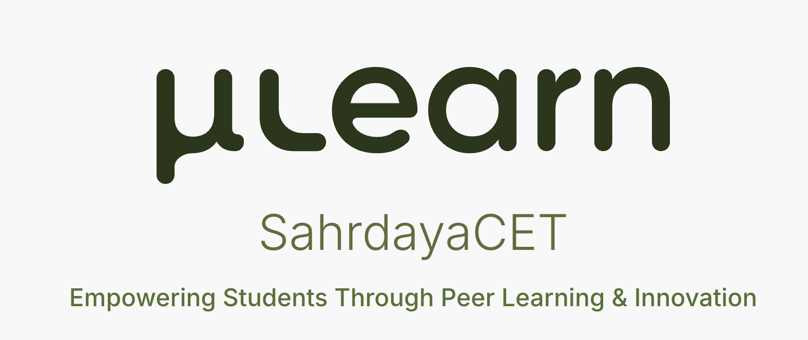

 

### The digital home of the µLearn community at Sahrdaya College of Engineering & Technology

Discover projects, relive campus events, meet the student team, and experience a community built around **learning by doing — together**.

  
  
  

  
  
  
  
  

---

## A campus community, made visible

**µLearn Sahrdaya** is the official campus platform for the peer-learning community at Sahrdaya CET, Kodakara. It brings the energy of the community into one coherent digital experience: projects, workshops, event stories, student leadership, challenges, and memories.

The platform is designed as more than a notice board. It is a living showcase of what students learn, build, organize, and celebrate together.

> **Discover → Participate → Build → Showcase → Grow**

## Explore the experience

<table>
  <tr>
    <td width="50%" valign="top">
      <h3>🏡 Community home</h3>
      
A welcoming overview of the campus community, its mission, projects, workshops, highlights, and people.

      
<a href="https://mulearnscet.in"><strong>Open the homepage →</strong></a>

    </td>
    <td width="50%" valign="top">
      <h3>📸 The Meme Archive</h3>
      
A dedicated visual archive for µLearn Orientation 2026, preserving hundreds of student meme recreations in a playful gallery.

      
<a href="https://mulearnscet.in/orientation-2026"><strong>Enter the archive →</strong></a>

    </td>
  </tr>
  <tr>
    <td width="50%" valign="top">
      <h3>⚡ Karma War</h3>
      
A focused event experience that presents the challenge, its winners, and the moments that made Karma War memorable.

      
<a href="https://mulearnscet.in/karma-war"><strong>View the event recap →</strong></a>

    </td>
    <td width="50%" valign="top">
      <h3>🤝 The people behind it</h3>
      
A dedicated team experience introducing the student leaders and interest-group leads who keep the community moving.

      
<a href="https://mulearnscet.in/team"><strong>Meet the team →</strong></a>

    </td>
  </tr>
</table>

## What makes the platform special

- **Student-first storytelling** — the website gives projects, events, teams, and community moments equal importance.
- **Distinct event identities** — major initiatives receive purpose-built visual experiences instead of generic content pages.
- **Motion with intention** — transitions and interactions add personality while keeping the content readable and approachable.
- **Responsive by design** — the experience is shaped for phones, tablets, and desktops rather than merely scaled between them.
- **Search-ready presentation** — route-specific metadata, social previews, structured data, and static fallbacks make public pages easier to discover and share.
- **Performance-conscious delivery** — route-level loading, optimized media, and a modern build pipeline keep the experience fast and focused.

## Technology

| Area | Foundation |
|---|---|
| **Interface** | React 19 and React Router 8 |
| **Styling** | Tailwind CSS 4 and a custom µLearn Sahrdaya design system |
| **Motion** | Framer Motion 12 |
| **Tooling** | Vite 7 and ESLint 9 |
| **Web presence** | Route-aware SEO, structured data, social previews, and progressive web metadata |

## Design language

The visual system draws from a warm, nature-inspired palette that feels energetic without becoming noisy.

| Deep green | Moss | Cornsilk | Earth yellow | Tiger's eye |
|:---:|:---:|:---:|:---:|:---:|
| `#283618` | `#606C38` | `#FEFAE0` | `#DDA15E` | `#BC6C25` |

The result is friendly, recognizable, and flexible enough to support both the main campus identity and more experimental event pages.

## Ownership and permitted use

> [!IMPORTANT]
> This repository contains **proprietary source code, visual assets, content, and brand material** created for µLearn Sahrdaya. Public visibility of the repository does not grant an open-source license. Copying, modification, redistribution, deployment, or commercial use is prohibited without explicit written authorization. **All rights reserved.**

## About µLearn Sahrdaya

µLearn Sahrdaya is the campus chapter of the µLearn peer-learning ecosystem at **Sahrdaya College of Engineering & Technology, Kodakara, Kerala**. The community helps students grow through peer-led learning, hands-on challenges, interest groups, projects, workshops, and collaborative events.

**Built and maintained by the µLearn Sahrdaya Tech Team**

[Campus website](https://mulearnscet.in) · [Team](https://mulearnscet.in/team) · [Instagram](https://www.instagram.com/mulearn.scet/) · [µLearn](https://mulearn.org)

Empowering students through peer learning and innovation.

